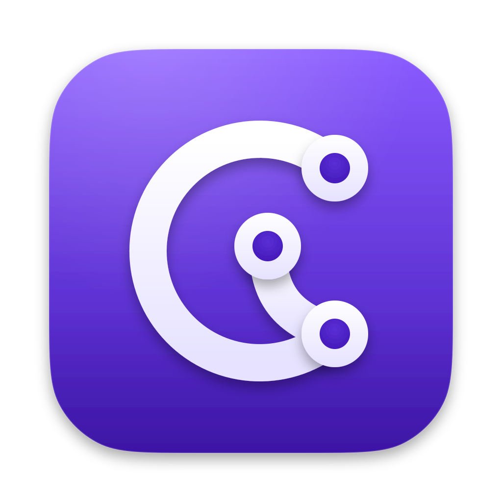

<p align="center"><br><a target="_blank" href="https://wasi-master.github.io/corvene/">Corvene Website</a></p>

# Corvene

A native, fast, low-memory [GitHub Desktop](https://github.com/apps/desktop) clone written in [Rust](https://rust-lang.org/).

The UI is a one-to-one recreation of [GitHub Desktop 3.6.6](https://github.com/desktop/desktop/releases/tag/release-3.6.6): same layout, buttons, menus, dialogs and workflow. The engine is different: [GPUI](https://gpui.rs/) ([Zed](https://zed.dev/)'s GPU-accelerated UI framework) for rendering, [gitoxide](https://github.com/gitoxidelabs/gitoxide) for in-process git reads, and the [git](https://git-scm.com/) CLI for writes so behaviour matches GitHub Desktop exactly.

Status: beta. Feature-complete with GitHub Desktop. Runs on macOS, Linux ([X11](https://en.wikipedia.org/wiki/X_Window_System) and [Wayland](https://wayland.freedesktop.org/), x86_64 and arm64), Windows 10 and 11 (x64, ARM64 and 32-bit x86) and Android (phones, tablets, [Chromebooks](https://www.google.com/chromebook/)). Android is experimental and comes as two apps (see below). Binaries for all of them are on [GitHub Releases](https://github.com/wasi-master/corvene/releases).

## Requirements

### macOS

- macOS 10.15.7 Catalina or newer on Intel, macOS 11 or newer on [Apple Silicon](https://support.apple.com/en-us/116943)
- `git` 2.38+ on your `PATH`: the [Xcode Command Line Tools](https://developer.apple.com/documentation/xcode/installing-the-command-line-tools) from Xcode 14.3 on ship 2.39, or use [Homebrew](https://brew.sh/)'s

### Windows

- Windows 10 1809 or newer, or Windows 11, on x64, ARM64 or 32-bit x86
- `git` 2.38+: [Git for Windows](https://gitforwindows.org/) on your `PATH`, or let the installer download [MinGit](https://github.com/git-for-windows/git/releases) for Corvene when it finds no git
- Signed-in accounts are stored in the [Windows Credential Manager](https://support.microsoft.com/en-us/windows/security/credential-manager-in-windows)

### Linux

- A distribution with [glibc](https://sourceware.org/glibc/) 2.35 or newer ([Ubuntu 22.04](https://releases.ubuntu.com/jammy/), [Debian 12](https://www.debian.org/distrib/), [Fedora 36](https://fedoraproject.org/) or later), on x86_64 or arm64
- An X11 or Wayland session, and a [Vulkan](https://www.vulkan.org/) driver (Mesa's drivers work)
- A [Secret Service](https://specifications.freedesktop.org/secret-service-spec/latest/) keyring for signed-in accounts: [GNOME Keyring](https://wiki.gnome.org/Projects/GnomeKeyring), [KWallet](https://apps.kde.org/kwalletmanager5/) or [KeePassXC](https://keepassxc.org/)
- `git` 2.38+ on your `PATH`; Ubuntu 22.04 ships an older git, so use the [git-core PPA](https://launchpad.net/~git-core/+archive/ubuntu/ppa) there

### Android

- Android 8.0 or newer on arm64, armv7, x86_64 or x86, with a [Vulkan](https://www.vulkan.org/) driver ([OpenGL ES](https://www.khronos.org/opengles/) is the fallback)
- Nothing else: git, [OpenSSH](https://www.openssh.com/) and [Git LFS](https://git-lfs.com/) are included inside the app prebuilt

## Install

### macOS

[Homebrew](https://brew.sh/) (recommended; the cask clears the quarantine attribute, so [Gatekeeper](https://support.apple.com/guide/security/gatekeeper-and-runtime-protection-sec5599b66df/web) does not block the unnotarized app):

```bash
brew install --cask wasi-master/corvene/corvene
```

Direct download from [GitHub Releases](https://github.com/wasi-master/corvene/releases): after the first launch is blocked, open System Settings → Privacy & Security and click "Open Anyway" (on macOS 14 and older, right-click the app and choose Open), or run `xattr -d com.apple.quarantine /Applications/Corvene.app`.

### Windows

Download from [GitHub Releases](https://github.com/wasi-master/corvene/releases) for your architecture (`x86_64`, `aarch64` for ARM64, `i686` for 32-bit):

- Installer (recommended): `Corvene-<version>-x86_64-setup.exe` installs for your user only, without administrator rights, into `%LOCALAPPDATA%\Programs\Corvene`. It adds a Start menu shortcut, puts `corvene` on your `PATH`, registers the `x-corvene://` links and offers "Open in Corvene" in Explorer's folder menus. It updates itself. Uninstall it from Settings › Apps; your settings in `%APPDATA%\Corvene` stay.
- Windows Installer: `Corvene-<version>-x86_64.msi` installs for every user into `Program Files\Corvene`, for deployment with Group Policy or Intune (`msiexec /i Corvene-<version>-x86_64.msi /qn`). Deploy a newer `.msi` to update; the app only says that a release is available.
- Portable: unzip `Corvene-<version>-windows-x86_64-portable.zip` anywhere (a USB stick works) and run `Corvene\corvene.exe`. No installer, no `PATH` entry, no self-update.

Every format also comes as `Corvene-Full`, with every tree-sitter grammar built in (see Linux below).

The packages are not code-signed yet, so [SmartScreen](https://learn.microsoft.com/en-us/windows/security/operating-system-security/virus-and-threat-protection/microsoft-defender-smartscreen/) warns on first launch: click "More info", then "Run anyway". A PC with [Smart App Control](https://support.microsoft.com/en-us/topic/what-is-smart-app-control-285ea03d-fa88-4d56-882e-6698afdb7003) turned on refuses to run them.

The installer and the `.msi` put the command line tool (`bin\corvene.bat`) on the `PATH`, so `corvene` in a terminal opens the current folder, like GitHub Desktop's `github`.

### Linux

[Homebrew](https://brew.sh/) (x86_64 and arm64; installs the AppImage as `~/Applications/Corvene.AppImage`, `brew upgrade corvene` updates it):

```bash
brew install --cask wasi-master/corvene/corvene
```

Or download the package for your distribution and architecture from [GitHub Releases](https://github.com/wasi-master/corvene/releases) (`x86_64`, `aarch64` / `arm64`, and the less tested 32-bit `i686` and `armhf`). Install a newer package the same way to update; only the AppImage updates itself.

- Debian and Ubuntu: `sudo apt install ./corvene_<version>_amd64.deb` (`arm64` on ARM).
- Fedora, openSUSE, RHEL and friends: `sudo dnf install ./corvene-<version>-1.x86_64.rpm` (`zypper install` on openSUSE).
- Any distribution: `chmod +x Corvene-<version>-x86_64.AppImage` (`aarch64` on ARM), then run it. The AppImage updates itself in place.
- Flatpak: `flatpak install --user Corvene-<version>-x86_64.flatpak` (the runtime comes from [Flathub](https://flathub.org/)). It sees your home folder; `flatpak override --user --filesystem=<path> com.wasimaster.corvene` adds others.
- Snap: `sudo snap install --dangerous Corvene-<version>-x86_64.snap`, then `sudo snap connect corvene:password-manager-service` (signed-in accounts) and `sudo snap connect corvene:ssh-keys` (git over SSH).
- Arch Linux: the `corvene-bin` PKGBUILD from the release workflow, or unpack `Corvene-<version>-linux-x86_64.tar.gz` (the `.deb`'s `/usr` tree) anywhere and run `usr/lib/corvene/corvene`.

Every format also comes as `Corvene-Full` (`corvene-full` for the `.deb` and `.rpm`): the same app with every tree-sitter grammar built in, so Settings › Advanced has nothing to download. It replaces the plain package and updates to the next Full release.

An AppImage (from Homebrew or downloaded) adds itself to the application menu and registers the `x-corvene://` links on first launch: it writes `~/.local/share/applications/com.wasimaster.corvene.desktop` and its icon under `~/.local/share/icons/hicolor`, and updates them when you move the file. It leaves this to [AppImageLauncher](https://github.com/TheAssassin/AppImageLauncher) or appimaged when one of them already added the AppImage. Delete those files to remove the entry (`brew uninstall --zap corvene` does).

File → Install Command Line Tool links `corvene` into `~/.local/bin`, the same command line tool GitHub Desktop has (the `.deb`, `.rpm` and `.tar.gz` put it in `/usr/bin` already; the Flatpak and the snap have none).

### Android

Two apps share the engine: **Corvene Legacy** (`com.wasimaster.corvene.legacy`) is the desktop application itself in a NativeActivity, GitHub Desktop 1:1, for tablets, Chromebooks and desktop modes; **Corvene** for Android (`com.wasimaster.corvene`, Jetpack Compose, in progress under `android/`) is built for phones. They install side by side. Download `Corvene-Legacy-<version>-android-foss-arm64.apk` (most phones and tablets; `-armv7` for 32-bit ones, `-x86_64` for most Chromebooks and emulators, `-universal` has every architecture) from [GitHub Releases](https://github.com/wasi-master/corvene/releases) and open it; Android asks once to let your browser or file manager install apps. Install a newer package the same way to update: repositories, accounts and settings stay. The play package next to it is the Google Play flavour, without "All files access". `Corvene-Legacy-Full-<version>-android-foss-<abi>.apk` has every tree-sitter grammar built in instead of downloading them. Android support is experimental and was tested on few devices, so expect rough edges.

## Building

```bash
cargo run -p corvene
```

On Linux, install the build dependencies first (Debian and Ubuntu package names):

```bash
sudo apt install clang mold pkg-config libxcb1-dev libxkbcommon-dev libxkbcommon-x11-dev \
  libwayland-dev libfontconfig-dev libfreetype-dev libvulkan-dev
```

On Windows, install [Visual Studio Build Tools](https://visualstudio.microsoft.com/visual-cpp-build-tools/) with the "Desktop development with C++" workload (the MSVC toolchain and the Windows SDK, whose `fxc.exe` compiles GPUI's shaders). `packaging/windows/package.ps1` builds the installer, the `.msi` and the portable zip from a release build; it needs [Inno Setup](https://jrsoftware.org/isinfo.php) 6.7 or 7 and, for the `.msi`, [WiX Toolset](https://wixtoolset.org/) 5 (`dotnet tool install --global wix --version 5.0.2`).

On macOS, development builds compile [Metal](https://developer.apple.com/metal/) shaders at runtime so a full [Xcode](https://developer.apple.com/xcode/) install is not required. Release builds in CI use precompiled shaders (`--no-default-features`).

### Android

With the [Android SDK](https://developer.android.com/studio) and [NDK 27.3.13750724](https://github.com/android/ndk/wiki/Unsupported-Downloads#r27d) (`ANDROID_HOME`, `ANDROID_NDK_HOME`), a [JDK 17](https://www.oracle.com/apac/java/technologies/downloads/) or newer (`JAVA_HOME`), [make](https://developers.make.com/make-cli), [perl](https://www.perl.org/), [Go](https://go.dev/) and [cargo-ndk](https://github.com/bbqsrc/cargo-ndk):

```bash
rustup target add aarch64-linux-android x86_64-linux-android
cargo install cargo-ndk
packaging/android/build.sh profiling foss
adb install packaging/android/app/build/outputs/apk/foss/debug/app-foss-debug.apk
```

The first run also cross-builds what the app bundles: git, curl, OpenSSL, OpenSSH and Git LFS. `profiling` puts the optimised library into a debug-signed package, ready for a device at hand; `release` is signed only when the `CORVENE_ANDROID_KEYSTORE` variables are set (see `packaging/android/build.sh`). `ABIS=arm64-v8a` builds one architecture only, and `play` instead of `foss` is the flavour for Google Play (no "All files access", grammars as an on-demand module).

## License

MIT. See [LICENSE](LICENSE) and [NOTICE](NOTICE).

## Trademarks

Corvene is an independent project. It is not affiliated with, sponsored by or endorsed by GitHub, Inc. GitHub® and GitHub Desktop are trademarks of GitHub, Inc.; they are used here only to describe what Corvene recreates and works with. Corvene does not ship GitHub's logos (the Invertocat or Octocat marks).
